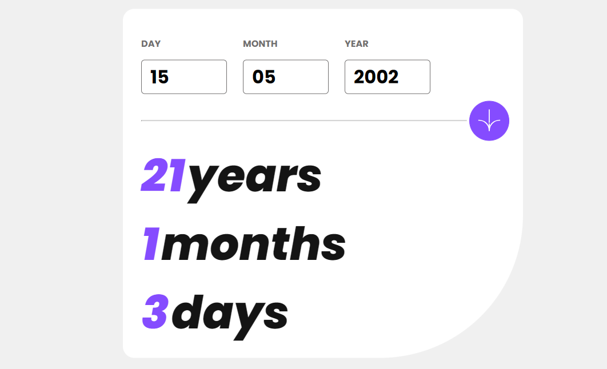
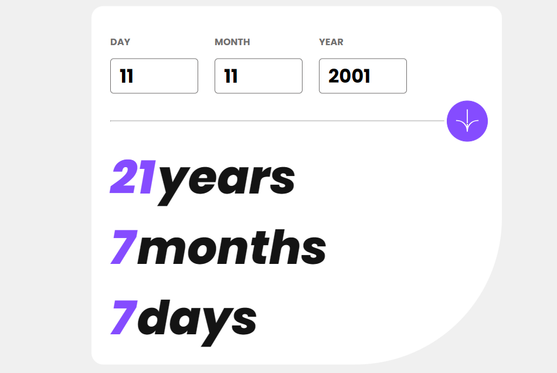
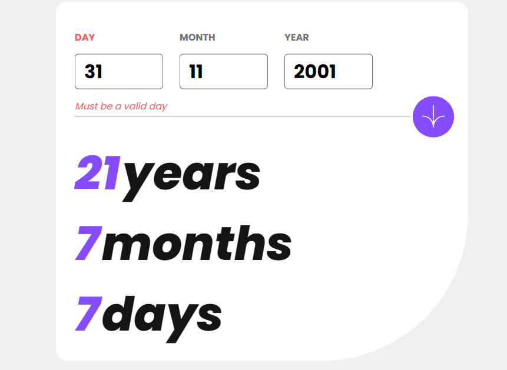
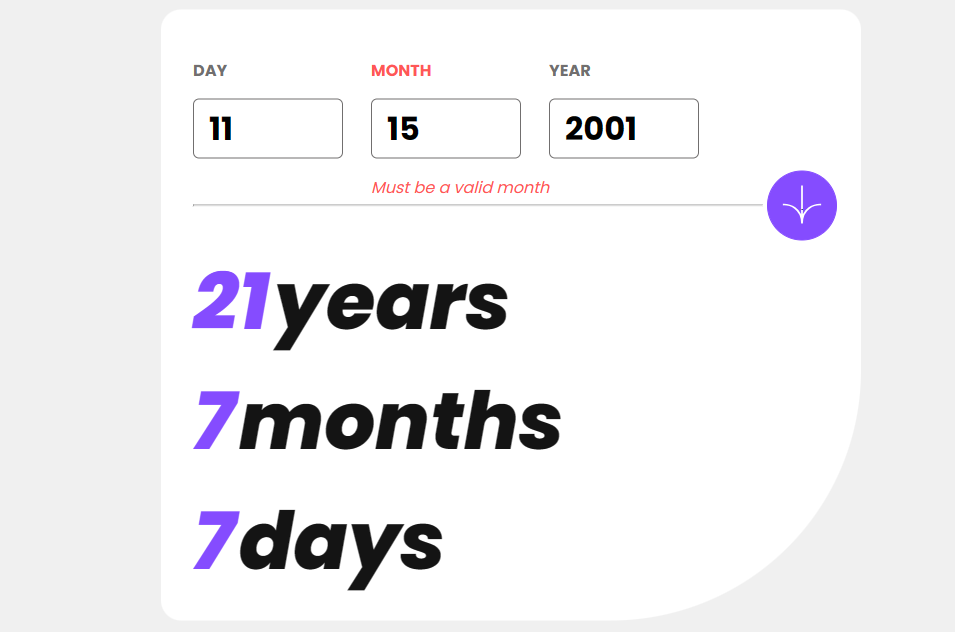
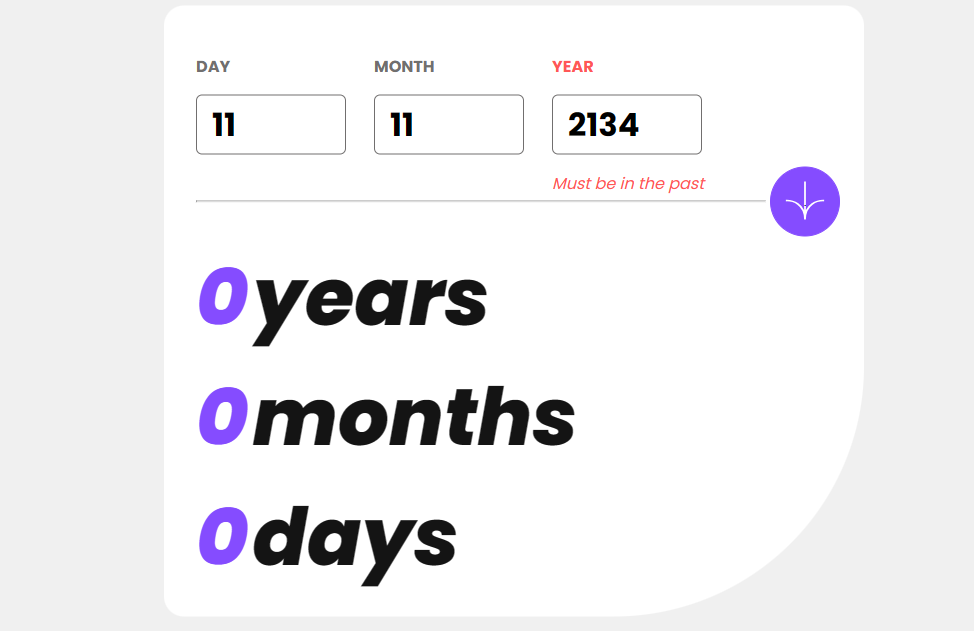

# Frontend Mentor - Age calculator app solution

This is a solution to the [Age calculator app challenge on Frontend Mentor](https://www.frontendmentor.io/challenges/age-calculator-app-dF9DFFpj-Q). Frontend Mentor challenges help you improve your coding skills by building realistic projects. 

## Table of contents

- [Overview](#overview)
  - [The challenge](#the-challenge)
  - [Screenshot](#screenshot)
  - [Links](#links)
- [My process](#my-process)
  - [Built with](#built-with)
  - [What I learned](#what-i-learned)
- [Author](#author)

**Note: Delete this note and update the table of contents based on what sections you keep.**

## Overview

### The challenge

Users should be able to:

- View an age in years, months, and days after submitting a valid date through the form
- Receive validation errors if:
  - Any field is empty when the form is submitted
  - The day number is not between 1-31
  - The month number is not between 1-12
  - The year is in the future
  - The date is invalid e.g. 31/04/1991 (there are 30 days in April)
- View the optimal layout for the interface depending on their device's screen size
- See hover and focus states for all interactive elements on the page
- **Bonus**: See the age numbers animate to their final number when the form is submitted

### Screenshot








### Links

- Live Site URL: [Github Pages](https://calebomondi.github.io/age-calculator/)

## My process

### Built with

- Semantic HTML5 markup
- CSS custom properties
- Basic JS

### What I learned

 The variable declarations should be inside the calcAge() function. Since you're assigning values to those variables based on user input, it's better to define them within the function's scope. 

```js
function calcAge(){
    var bDate = document.getElementById("bD").value;
    var bMonth = document.getElementById("bM").value;
    var bYear = document.getElementById("bY").value;

    var BDval = parseInt(bDate);
    var BMval = parseInt(bMonth);
    var BYval = parseInt(bYear);

    var today = new Date();
    var CDate = today.getDate();
    var cMonth = today.getMonth() + 1;
    var cYear = today.getFullYear();

    var years = cYear - BYval;
    var months = cMonth - BMval;
    var days = CDate - BDval;
}
```

### Useful resources

- [dev.to](https://dev.to/code_mystery/javascript-age-calculator-calculate-age-from-date-of-birth-o9b) - This website gave the idea of how to go about to write the code to calculate the age as well as given errors where necessary.

## Author

- Frontend Mentor - [@calebomondi](https://www.frontendmentor.io/profile/calebomondi)
- Twitter - [@kalebmokua_](https://www.twitter.com/kalebmokua_)

